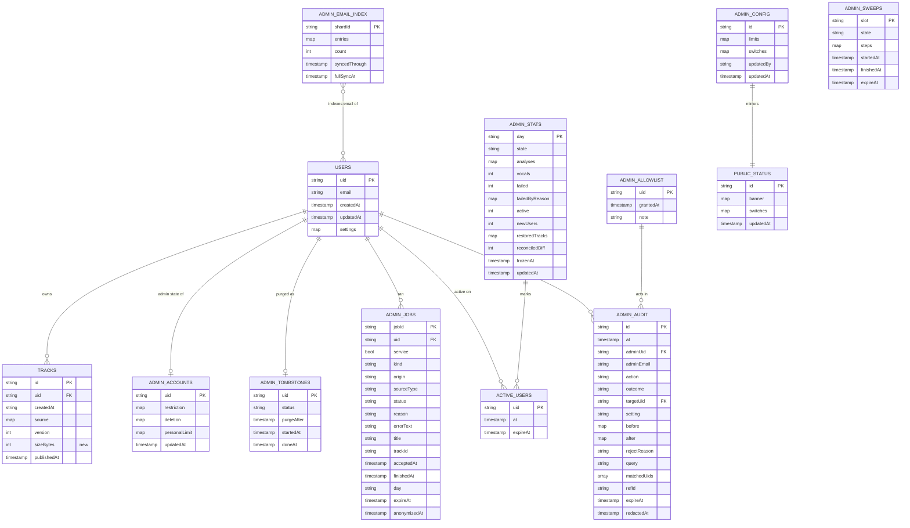

# Data model — admin

> **Upstream:** [spec](./spec.md) §5–§6.1 · [SAD](./sad.md) §4–§8 · ADR-0004…0011 · [CONTEXT](./CONTEXT.md)
> **Store:** Firestore `(default)`, eur3 (`firebase.json`), written only by the server's service account over REST (`backend/app/firestore.py`); GCS bucket mounted at `/data`. There is **no SQL and no migration tool** in this repo: a schema change is a `firestore.rules` + `firestore.indexes.json` change plus an idempotent `python -m …` backfill run as a Cloud Run job on the service image (the `app.publish backfill` pattern). The staged "migrations" under [`migrations/`](./migrations/) follow that form: up/down pairs.

**Conventions followed (detected, not imposed):**

| Topic | Repo convention | Applied here |
|---|---|---|
| Collection / field naming | `users`, `users/{uid}/tracks`; camelCase fields (`createdAt`, `publishedAt`, `chordCount`) | new top-level collections `admin*` (camelCase ids) + `publicStatus`; camelCase fields |
| Document ids | natural ids (Firebase uid, track id) | uid, job id (`secrets.token_hex(8)`), UTC day `YYYY-MM-DD`, Firestore auto-id for audit (SAD §8) |
| Timestamps | Firestore `timestamp` (`users.createdAt`, `publishedAt`); `tracks.createdAt` is an ISO string (pre-existing) | `timestamp` for every new time field (TTL needs it); UTC day keys as `YYYY-MM-DD` strings like `utc_day()` |
| Audit columns | `createdAt` + `updatedAt` on `users`; `publishedAt` on `tracks` | `updatedAt` on mutable docs (`adminAccounts`, `adminConfig`, `publicStatus`); event docs carry their own event time (`at`, `acceptedAt`) |
| Delete strategy | hard delete (`FirestoreIndex.delete`) | hard delete + TTL policies for retention; **anonymize-in-place** for audit and job history on purge (spec AC-22) |
| Constraints | none in the DB (Firestore); shape enforced in `firestore.rules` for client writes, in Pydantic for server writes | server-only collections: validation in Pydantic models (`backend/app/admin/*`); `firestore.rules` gates access only |
| Access | default deny; owner-only for `users/**`; service account bypasses rules | every `admin*` collection: no client access; `publicStatus/current`: public `get` only |

## ER diagram

Firestore has no foreign keys: `FK` marks a reference field the server resolves by uid. `ADMIN_SWEEPS` stands alone (an operational record).

## Entities

### Aggregate 1 — Account (root: `users/{uid}`, existing)

The account aggregate: the client-owned profile (`users/{uid}`, existing, **unchanged**), the library (`users/{uid}/tracks`, existing, **+1 server field**), and two server-only satellites keyed by the same uid. The client-writable `users/{uid}` can't hold admin fields (its rule is `hasOnly([...])` and the owner can read it, while the restriction reason is admin-only, spec §6.1), so admin state lives beside it.

#### `users/{uid}/tracks/{trackId}` — delta: `sizeBytes`

| Field | Type | Constraints | Notes |
|---|---|---|---|
| `sizeBytes` | int | nullable during backfill, then always set by the publish path | bytes of the track directory on `/data` (audio, stems, `track.json`, edits). Feeds «зайняте місце» on the card via a `sum()` aggregation. Server-written like every other field of this doc |

**Why a field and not a projection:** the card gets «кількість пісень» = `count()` and «зайняте місце» = `sum(sizeBytes)` over the user's own tracks collection: 2 aggregation reads, exact, nothing to keep in sync. A `trackCount`/`storageBytes` counter on another doc would drift on republish/delete.
**Change kind:** a nullable field added to an existing collection, so the expand step comes first: [`01`](./migrations/01_add_track_size.up.py) backfills it, then the publish path writes it. There is no contract step: clients ignore the extra field (`frontend/src/lib/cloud/library.ts` maps known fields).
**Access patterns:** the songs page on the card (`createdAt` desc, pages of 50) uses the existing single-field index. `tracks.createdAt` is an ISO-8601 `Z` string, which sorts correctly as text.

#### `adminAccounts/{uid}` — account admin state (server-only, sparse)

Exists **only for users an admin has acted on**. No document means the normal state with no personal limit. Created by the first state-changing admin action. Deleted by the purge.

| Field | Type | Constraints | Notes |
|---|---|---|---|
| *(doc id)* | string | = Firebase uid | |
| `restriction` | map \| null | | `{reason: string 1–500, since: timestamp, byAdminUid: string}`. `reason` is admin-only (never sent to the user, AC-18) |
| `deletion` | map \| null | | `{scheduledAt: timestamp, purgeAfter: timestamp (= scheduledAt + 7 d), byAdminUid: string, priorRestriction: map \| null}`. While set, `restriction` is also set (AC-20) and is changed only by cancel (AC-23b) |
| `personalLimit` | map \| null | at least one number set (AC-14) | `{analyses?: int 1–1000, vocals?: int 1–150, jobs?: int 1–4, until?: "YYYY-MM-DD" (last day inclusive, UTC), setAt: timestamp, byAdminUid: string}`. An absent number follows the default limit (AC-13b) |
| `updatedAt` | timestamp | NOT NULL | every write |

**Aggregate root:** `users/{uid}` (same id).
**Access patterns:** `get` by uid (card; admission gate, cached 60 s); `deletion.purgeAfter <= now` (sweep: due purges), served by the automatic single-field index on the nested field.
**Concurrency:** restrict ↔ schedule deletion ↔ cancel ↔ unrestrict run as one Firestore transaction on this doc, with the audit record in the same commit (ADR-0007, SAD §8).
**Validation:** Pydantic in `backend/app/admin/actions.py`. Ranges come verbatim from AC-14. The `reason` length bound is `<!-- TBD: spec gives none; 500 proposed -->`.

#### `adminTombstones/{uid}` — purge marker (server-only)

| Field | Type | Constraints | Notes |
|---|---|---|---|
| *(doc id)* | string | = purged uid | no personal data: uid + times only (ADR-0011) |
| `status` | string | `purging` \| `done` | |
| `purgeAfter` | timestamp | NOT NULL | copied from `deletion.purgeAfter`, used for the NFR «≤ 24 год після вікна» check |
| `startedAt` | timestamp | NOT NULL | step 1 of the purge |
| `doneAt` | timestamp \| null | | last step |

**Aggregate root:** the account (it outlives `users/{uid}` on purpose).
**Access patterns:** `get` by uid (publish path, admission gate, job completion: «надгробок є?»); `status == "purging"` (sweep resumes interrupted purges) via the automatic single-field index.
**Retention:** kept forever (tiny, no PII). It is what stops `publish-pending.json` retries and late jobs from re-creating data.

### Aggregate 2 — Job history (root: `adminJobs/{jobId}`)

| Field | Type | Constraints | Notes |
|---|---|---|---|
| *(doc id)* | string | = `JobRecord.id` (`secrets.token_hex(8)`) | makes the accept write idempotent (SAD §8) |
| `uid` | string | NOT NULL | owner. Kept after purge; the UI shows «видалений» via the tombstone |
| `service` | bool | NOT NULL | `uid == SMOKE_UID`: labelled «службовий», excluded from stats and reconciliation (spec OQ, resolved 2026-10-08) |
| `kind` | string | `analysis` \| `vocals` | |
| `origin` | string | `link` \| `file` \| `mic` \| `tab` | «джерело» from CONTEXT. `<!-- TBD (api): POST /api/jobs/storage can't tell mic from file today; it needs a client origin hint. Re-analysis inherits the track's origin -->` |
| `sourceType` | string | `youtube` \| `other` | AC-07 «YouTube» filter: `youtube` when the job's source is a YouTube video (link, fragment, tab capture), else `other`. Records from before the field read as `other` |
| `status` | string | `running` \| `done` \| `error` | `running` from accept to finish |
| `reason` | string \| null | set iff `status == error` | fixed list: `youtube_blocked`, `download_failed`, `unsupported_format`, `too_long`, `too_large`, `analysis_failed`, `other`. Mapped from `ErrorCode` in `admin/history.py`; stale-job sweep → `other` |
| `errorText` | string \| null | ≤ 200 chars | short error text, shown as plain text (AC-05/07). Never indexed |
| `title` | string \| null | ≤ 300 chars (= `StorageJobRequest.title`) | **nulled on purge**. Never indexed |
| `trackId` | string \| null | | nulled on purge |
| `acceptedAt` | timestamp | NOT NULL | |
| `finishedAt` | timestamp \| null | | |
| `day` | string | `YYYY-MM-DD` of `acceptedAt` | the stats day this job counts into |
| `expireAt` | timestamp | = `acceptedAt` + 90 d | **TTL policy** (NFR ≥ 90 днів) |
| `anonymizedAt` | timestamp \| null | | set by purge |

**Aggregate root:** root (references the account by `uid`).
**Write rules:**
- **Accept:** one transaction. Create `adminJobs/{jobId}` with precondition `exists=false`. If `adminStats/{day}/activeUsers/{uid}` is absent, create it and increment `active`. Increment `analyses.<origin>` or `vocals` on `adminStats/{day}`. A replay that hits an existing doc is a no-op.
- **Finish:** a transaction reads the job. If `status != running`, it is a no-op (idempotent replay). Otherwise it sets the outcome and, on `error`, increments `failed` and `failedByReason.<reason>`, **but only while `adminStats/{day}.state == "live"`**. A frozen day never changes (ADR-0010).
- **Failure of either write:** the op goes to the GCS buffer `<data>/admin/projections-pending.json` (`{"ops": [{"op": "accept" | "finish", "jobId", "payload", "at"}]}`, a leaf lock like `publish-pending.json`). It is replayed on the next projection write and by every sweep **before** reconciliation. The job itself never fails because of this (SAD §6 «Проєкції»).

### Aggregate 3 — Daily stats (root: `adminStats/{day}`)

| Field | Type | Constraints | Notes |
|---|---|---|---|
| *(doc id)* | string | `YYYY-MM-DD` (UTC) | |
| `state` | string | `live` \| `frozen` \| `restored` | `restored` = rebuilt from tracks before launch (AC-08), never reconciled |
| `analyses` | map | `{link, file, mic, tab}`: int ≥ 0 | accepted cloud analyses by origin |
| `vocals` | int | ≥ 0 | accepted vocal transcriptions |
| `failed` | int | ≥ 0 | |
| `failedByReason` | map | reason → int | |
| `active` | int | ≥ 0 | distinct users with ≥ 1 accepted job |
| `newUsers` | int \| null | | written at freeze (`count()` over `users.createdAt` in the day). The live day computes it on read |
| `restoredTracks` | map \| null | `{youtube, url, file}`: int | only for `restored`: tracks added by raw `source.type` (old tracks can't tell link from tab or mic from file) |
| `reconciledDiff` | int \| null | | Σ\|live − recomputed\| at freeze. > 0 → metric `stats_mismatch` |
| `frozenAt` | timestamp \| null | | |
| `updatedAt` | timestamp | NOT NULL | |

#### `adminStats/{day}/activeUsers/{uid}`

| Field | Type | Constraints | Notes |
|---|---|---|---|
| *(doc id)* | string | uid | create-if-absent marks «active today» exactly once |
| `at` | timestamp | NOT NULL | |
| `expireAt` | timestamp | = day + 3 d | **TTL**. Reconciliation recomputes `active` from `adminJobs`, so markers are disposable |

**Aggregate root:** `adminStats/{day}`.
**Access patterns:** `get` today (overview); `get` × ≤ 90 by id (period, AC-08/09). No query, so no index.
**Freeze (sweep, order matters):** replay the projections buffer → close stale `running` jobs as `other` → recompute yesterday from `adminJobs` where `day == D` and `service == false` → write the corrected totals, with `state = frozen` **only if no job of day D is still `running`** (otherwise the day stays `live` and the next slot freezes it), so a late failure is never lost from its day.
**Retention:** forever (one small doc per day).

### Aggregate 4 — Admin audit log (root: `adminAudit/{autoId}`)

| Field | Type | Constraints | Notes |
|---|---|---|---|
| *(doc id)* | string | Firestore auto-id | |
| `at` | timestamp | NOT NULL | sort key |
| `adminUid` | string | NOT NULL | |
| `adminEmail` | string | NOT NULL | the admin's own email at the time. Admins can't be purged by themselves (AC-17) |
| `action` | string | enum | `search`, `view_card`, `quota_reset`, `limit_set`, `limit_removed`, `restrict`, `unrestrict`, `deletion_scheduled`, `deletion_cancelled`, `defaults_changed`, `switch_changed`, `banner_changed` |
| `outcome` | string | `applied` \| `rejected` \| `not_applied` | `not_applied` = follow-up record of a «журнал перший» action whose effect failed (ADR-0007) |
| `targetUid` | string \| null | | the user acted on or viewed. **No target email stored**: the UI resolves it from the email index, and «видалений» when tombstoned (AC-11) |
| `setting` | string \| null | | `limits`, `switches.<name>`, `banner` |
| `before` / `after` | map \| null | | what was / what became (AC-10). For `quota_reset`: old `{analyses, vocals}`. Never indexed |
| `rejectReason` | string \| null | set iff `outcome == rejected` | code: `self_target`, `deletion_pending`, `deletion_rate_limit`, `not_scheduled`, … |
| `query` | string \| null | `action == search` only, 3–254 chars | the search string (AC-10b). **Redacted on purge** if the purged uid is in `matchedUids` |
| `matchedUids` | array\<string\> \| null | ≤ 50 | uids returned by that search. Exists to drive the redaction |
| `refId` | string \| null | | for `not_applied`: id of the record it completes |
| `expireAt` | timestamp | = `at` + 400 d | **TTL** (NFR ≥ 365 днів) |
| `redactedAt` | timestamp \| null | | set by purge |

**Aggregate root:** root. **Append-only**: no API or client path updates or deletes a record. The only in-place changes are the purge redaction (spec AC-22 «знеособлені») and TTL expiry.
**Purge redaction:** on records where `targetUid == uid`, delete `before.reason`/`after.reason` (restriction reasons) and set `redactedAt`. On records where `matchedUids array-contains uid`, set `query = null` and remove the uid from `matchedUids`.
**Access patterns:** see Indexes (journal filters; deletion rate limit; purge).

### Aggregate 5 — Email search index (root: `adminEmailIndex/{shardId}`, projection)

| Field | Type | Constraints | Notes |
|---|---|---|---|
| *(doc id)* | string | `s000`, `s001`, … | ≤ ~20 000 entries per shard (1 MiB doc limit, SAD §7) |
| `entries` | map | uid → lower-cased email | **exempt from indexing** (otherwise 1 index entry per uid; Firestore caps a doc at 40 000) |
| `count` | int | | entries in the shard |
| `syncedThrough` | timestamp | | max `users.createdAt` folded in. The catch-up reads `users` with `createdAt > syncedThrough` (ADR-0009) |
| `fullSyncAt` | timestamp | | last full rebuild (sweep) |

**Aggregate root:** projection of `users` (rebuilt from it; disposable). The cursor lives in every shard, and the server takes the minimum. The purge removes `entries.<uid>`.
**Access patterns:** `get` all shards (≤ 3) → in-memory substring search; `users.createdAt > cursor` uses the automatic single-field index on `users.createdAt`. It also serves the `newUsers` `count()`.

### Aggregate 6 — Runtime configuration (root: `adminConfig/settings`)

#### `adminConfig/settings` (server-only, singleton)

| Field | Type | Constraints | Notes |
|---|---|---|---|
| `limits` | map | `{analyses: int 1–1000, vocals: int 1–150, jobs: int 1–4, maxDurationMin: int 1–120, maxUploadMb: int 1–512}` | AC-25. Seeded from `CHORDS_QUOTA_*` / `CHORDS_MAX_*` if absent (ADR-0005) |
| `switches` | map | `{analysesPaused: bool, youtubeEnabled: bool, vocalsEnabled: bool}` | source of truth for the admission gate |
| `updatedBy` | string \| null | | admin uid |
| `updatedAt` | timestamp | NOT NULL | |

#### `publicStatus/current` (public read, singleton)

| Field | Type | Constraints | Notes |
|---|---|---|---|
| `banner` | map | `{enabled: bool, uk: string 1–250, en: string 1–250}` | AC-29/30. Shown as plain text |
| `switches` | map | same three bools as `adminConfig.switches` | mirror for the site (AC-27, 0 server requests) |
| `updatedAt` | timestamp | NOT NULL | |

**Aggregate root:** `adminConfig/settings`. `publicStatus/current` is its mirror. A switch change writes **both + the audit record** in one batched write. A banner change writes `publicStatus` + audit. Every write uses an `updateMask` limited to its own fields (`banner.*` or `switches.*`) so the two never clobber each other (SAD §6 flag).
**Field allowlist (security):** `publicStatus/current` holds **only** `banner`, `switches`, `updatedAt`. Enforced in `admin/settings.py` and by a test (SAD §11). No limits, no uids, no emails.

### Aggregate 7 — Admin access (root: `adminAllowlist/{uid}`)

| Field | Type | Constraints | Notes |
|---|---|---|---|
| *(doc id)* | string | admin's uid | presence = admin |
| `grantedAt` | timestamp | NOT NULL | |
| `note` | string \| null | ≤ 200 | free note by the owner (never an email) |

Written **only** by `scripts/admin_grant.py` with the owner's ADC (ADR-0006). The server only `get`s it (cache 60 s). No seed: the first admin is granted by the owner running the script.

### Operational — `adminSweeps/{slot}`

| Field | Type | Constraints | Notes |
|---|---|---|---|
| *(doc id)* | string | `YYYY-MM-DDTHH:MMZ` (scheduled slot) or `YYYY-MM-DD-wake` (first natural wake after 00:00) | idempotency key (SAD §6 «фонові роботи») |
| `state` | string | `running` \| `done` \| `failed` | create with `exists=false` to claim the slot |
| `steps` | map | step → `done` | resume point |
| `startedAt` / `finishedAt` | timestamp | | |
| `expireAt` | timestamp | = `startedAt` + 30 d | **TTL** |

### Not in Firestore (unchanged or in-memory)

- Daily quota counters: `<data>/users/<uid>/quota.json` (unchanged; reset under the `Quotas` lock, ADR-0003).
- Non-admin probe rate limit (AC-36), the 10-per-60-min deletion lock, and caches: process memory (max 1 instance, SAD §11).
- «Останній вхід»: read live from Firebase Auth (`lastLoginAt`) on card open, not stored, so there's nothing to purge or drift.

## Indexes

Firestore builds single-field indexes automatically. Only the **composite** indexes and **exemptions/TTL** below are declared (in `firestore.indexes.json`, staged as [`02`](./migrations/02_admin_indexes_and_ttl.up.json)).

**Staged migrations** (promotion order; `implement` copies them into place):

| # | Up / down | What | Promoted to |
|---|---|---|---|
| 01 | [`01_add_track_size.up.py`](./migrations/01_add_track_size.up.py) / [`.down.py`](./migrations/01_add_track_size.down.py) | expand: `tracks.sizeBytes` backfill | a `python -m` backfill run as a Cloud Run job on the service image |
| 02 | [`02_admin_indexes_and_ttl.up.json`](./migrations/02_admin_indexes_and_ttl.up.json) / [`.down.json`](./migrations/02_admin_indexes_and_ttl.down.json) | composite indexes, TTL, exemptions | `firestore.indexes.json` → `firebase deploy --only firestore:indexes` |
| 03 | [`03_admin_rules.up.rules`](./migrations/03_admin_rules.up.rules) / [`.down.rules`](./migrations/03_admin_rules.down.rules) | `publicStatus` public get; admin collections denied | `firestore.rules` → `firebase deploy --only firestore:rules` |
| 04 | [`04_seed_runtime_config.up.py`](./migrations/04_seed_runtime_config.up.py) / [`.down.py`](./migrations/04_seed_runtime_config.down.py) | bootstrap seed: config + public status from env | Cloud Run job |
| 05 | [`05_build_email_index.up.py`](./migrations/05_build_email_index.up.py) / [`.down.py`](./migrations/05_build_email_index.down.py) | email index from `users` | Cloud Run job |
| 06 | [`06_restore_stats_from_tracks.up.py`](./migrations/06_restore_stats_from_tracks.up.py) / [`.down.py`](./migrations/06_restore_stats_from_tracks.down.py) | restored days before launch (AC-08) | Cloud Run job, `--before <launch day>` |

Shared REST helper: [`_fsrest.py`](./migrations/_fsrest.py).

| Index | Columns | Query it serves |
|---|---|---|
| `adminJobs_status_acceptedAt` | `status` ASC, `acceptedAt` DESC | history filtered by result (AC-07); stale-`running` sweep (`status == running AND acceptedAt < now − 2 h`) |
| `adminJobs_reason_acceptedAt` | `reason` ASC, `acceptedAt` DESC | history filtered by reason + per-reason `count()` (AC-07) |
| `adminJobs_origin_acceptedAt` | `origin` ASC, `acceptedAt` DESC | history filtered by source (AC-07). Combined filters merge these three indexes (zig-zag merge on the shared `acceptedAt DESC` suffix) |
| `adminJobs_sourceType_acceptedAt` | `sourceType` ASC, `acceptedAt` DESC | history filtered by YouTube / other (AC-07); merges with the three above |
| `adminJobs_uid_acceptedAt` | `uid` ASC, `acceptedAt` DESC | the user's recent jobs on the card (US-03); purge anonymization (`uid == X`) |
| `adminAudit_adminUid_at` | `adminUid` ASC, `at` DESC | journal filtered by admin (US-06) |
| `adminAudit_targetUid_at` | `targetUid` ASC, `at` DESC | journal filtered by user (US-06); purge redaction (`targetUid == X`) |
| `adminAudit_action_at` | `action` ASC, `at` DESC | journal filtered by action type (US-06). Combined filters merge with the two above |
| `adminAudit_action_outcome_at` | `action` ASC, `outcome` ASC, `at` DESC | `count()` of `deletion_scheduled` + `applied` in the last 60 min (AC-35) |
| *(auto)* `adminAudit.matchedUids` array-contains | — | purge redaction of search queries |
| *(auto)* `adminAccounts.deletion.purgeAfter` | — | sweep: due purges |
| *(auto)* `adminTombstones.status` | — | sweep: interrupted purges |
| *(auto)* `adminJobs.day` | — | nightly reconciliation of one day |
| *(auto)* `users.createdAt` | — | email-index catch-up; `newUsers` `count()` |

**Exemptions / TTL (field overrides):**

| Field | Override | Why |
|---|---|---|
| `adminJobs.expireAt` | TTL, not indexed | NFR history ≥ 90 d |
| `adminAudit.expireAt` | TTL, not indexed | NFR journal ≥ 365 d (+400 d) |
| `adminSweeps.expireAt` | TTL, not indexed | housekeeping |
| `activeUsers.expireAt` (collection group) | TTL, not indexed | disposable markers |
| `adminEmailIndex.entries` | not indexed | 20 000-key map would exceed the per-doc index-entry cap |
| `adminAudit.before`, `adminAudit.after` | not indexed | free-shape maps, never queried |
| `adminJobs.errorText`, `adminJobs.title` | not indexed | long user text, never queried, and keeps user text out of indexes |

**Read budget (NFR ≤ 200 per screen):** overview 1 (`adminStats/today`) + 1 `count()` + config (cached) ≈ 3 · search 1–3 shards + new-users catch-up · card: users 1 + adminAccounts 1 + tombstone 1 + 2 aggregations + 50 tracks + 20 jobs ≈ 76 · history page: 50 + 7 reason `count()`s ≈ 57 · journal page: 50 (+ shards, cached) · stats: ≤ 90.

## Test fixtures

Not in migrations. Built in the repo's form: plain factory functions + fakes in `backend/tests/` (cf. `FakeIndex`, `FakeSession` in `test_cloud.py` / `test_firestore.py`), and an emulator seeder for integration tests. PII guard: `example.test` only.

- `make_admin(uid="admin-1")` → `adminAllowlist/{uid}`; token email `admin@example.test`.
- `make_user(uid=None, email=None, created_at=None)` → `users/{uid}` with `user-<uid>@example.test`, default `settings`.
- `make_tracks(uid, n, start=…, origin="file", size=1_000_000)` → `users/{uid}/tracks/*` with `createdAt`, `source`, `sizeBytes`. Covers «1 user × 1 000 tracks» (NFR read budget).
- `make_account_state(uid, restriction=None, deletion=None, personal_limit=None)` → `adminAccounts/{uid}`.
- `make_job(uid, status="error", reason="youtube_blocked", origin="link", accepted_at=…)` → `adminJobs/{id}`.
- `make_stats_day(day, state="live", **counters)` → `adminStats/{day}`.
- `make_audit(action, outcome="applied", admin_uid="admin-1", target_uid=None, **extra)` → `adminAudit/{id}`.
- `seed_synthetic_users(n=10_000)` → `users/*` + `adminEmailIndex` (NFR search p95 at 10 000 users).
- `HOSTILE_STRINGS`: ``, `">`, `javascript:alert(1)`, RTL override `‮`, ≥ 300-char strings, used as titles, error texts and emails (`x+<b>@example.test`) for AC-05.
