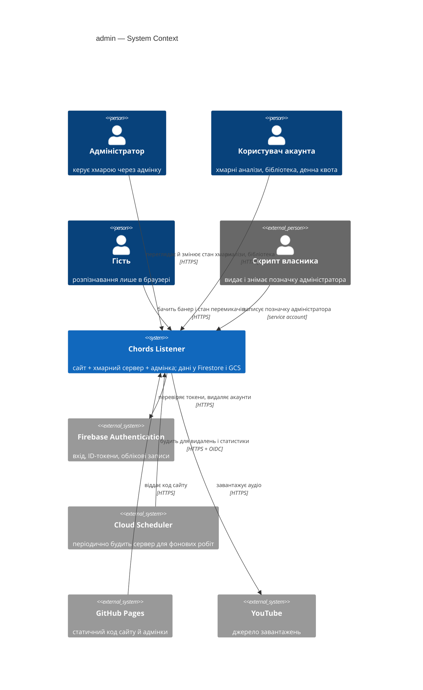
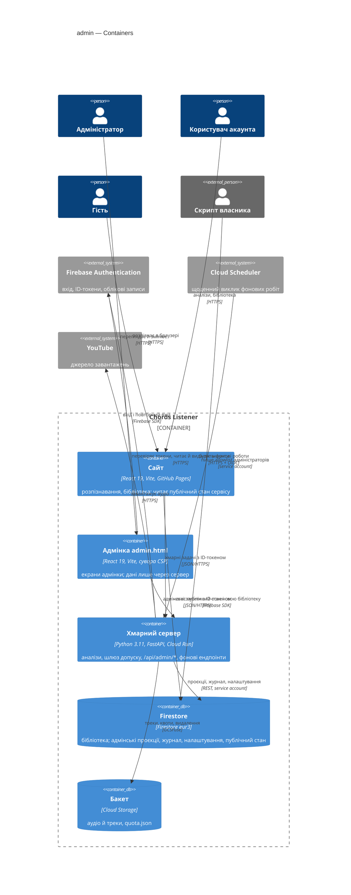
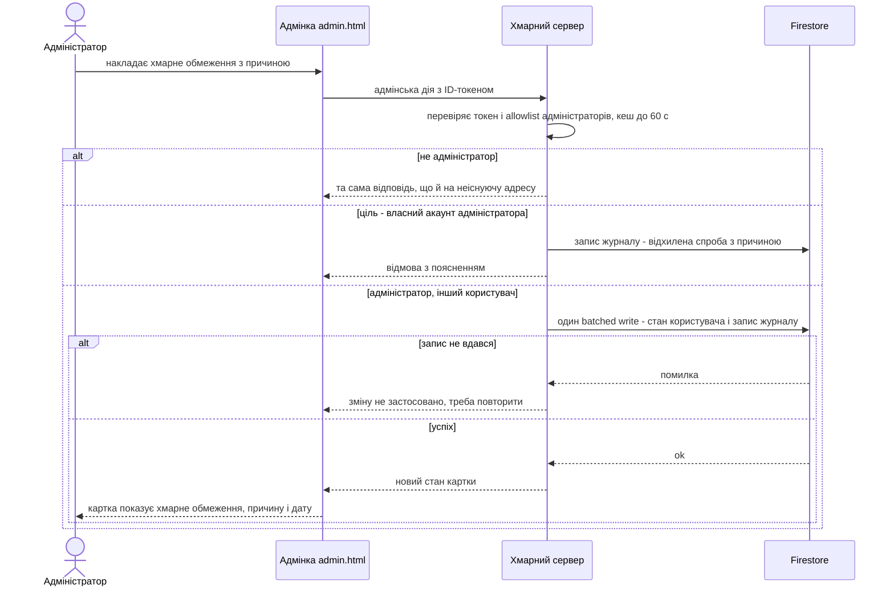
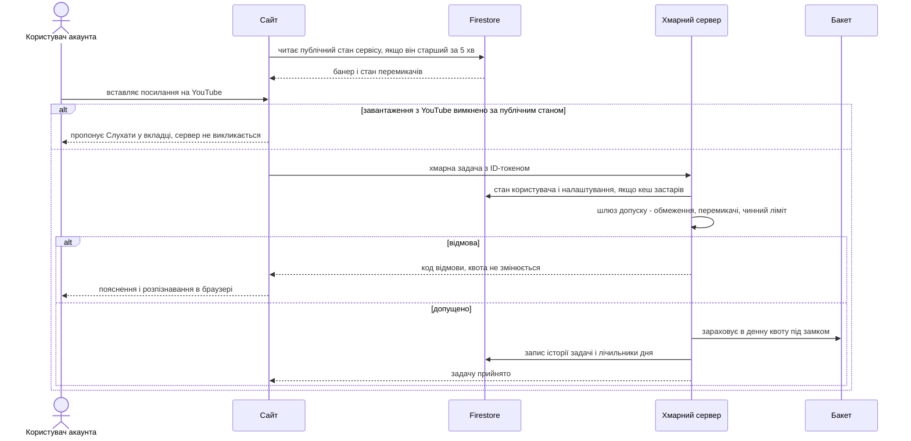
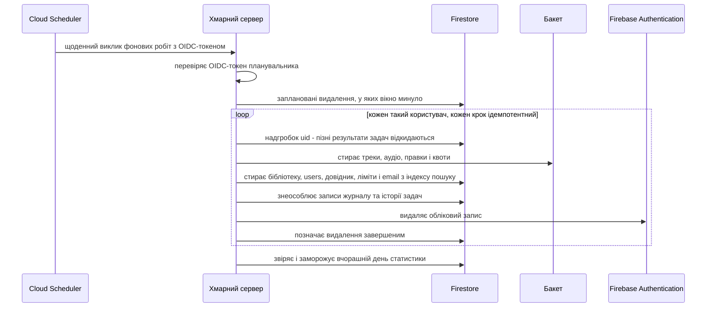

# Software Architecture Document — admin

<!-- 12 Arc42 sections. Empty section → <!-- N/A: <one-line reason> -->. -->
<!-- C4 Context (L1) lives inline in §3. C4 Container (L2) lives inline in §5. -->
<!-- Numbers in §10 come VERBATIM from spec.md §6 NFR — no inventing, no rounding. -->

## 1. Introduction and goals

<!-- 🎯 Why: durable memory of «what + the three dominant qualities + who cares». A year from
     now nobody recalls which three qualities were critical for this system.
     📋 Write: 1 ¶ intent + 3 lines of top-3 quality goals + a stakeholders table.
     ¶4 is the override slot — critic `Override` resolutions emit «Decision override: <headline>
     — rationale: <reason>» bullets here so downstream skills see the deliberate choice. -->

**Intent.** Власна адмінка всередині Chords Listener для Адміністратора: перегляд стану хмари (огляд доби, користувачі акаунтів і їхні картки, історія задач і причини збою, денна статистика, журнал дій адміністратора), дії з користувачами акаунтів (скидання денної квоти, персональний ліміт, хмарне обмеження, заплановане видалення) і налаштування сервісу (типові ліміти, перемикачі сервісу, банер обслуговування) без повторного розгортання сервера. Мета — витрати під контролем, швидка підтримка, розуміння продукту й готовність до тарифів (spec §2). Постачається трьома етапами: (1) перегляд, (2) дії з користувачами, (3) налаштування сервісу.

**Top-3 quality goals (1-liners; full scenarios in §10):**

1. **Безпека межі адміністратора** — права перевіряє сервер на кожен адмінський запит; без запису в журнал дій адміністратора ні дія, ні перегляд особистих даних не відбувається; текст від користувачів завжди лише текст.
2. **Вартість і сон сервера** — ≤ 200 читань сховища на екран адмінки; відкрита вкладка без дій створює 0 запитів до сервера; банер і стан перемикачів на сайті — 0 запитів до хмарного сервера.
3. **Керованість без розгортання** — зміни, які застосовує сервер, набувають чинності ≤ 60 с; банер і стан перемикачів на сайті для нових відвідувань — ≤ 5 хв.

Інші NFR (повнота видалення, точність денної статистики, зберігання журналу й історії задач, latency, availability) мають власні сценарії в §10.

**Stakeholders.**

| Role | Interest | Sign-off owner? |
|---|---|---|
| Адміністратор | Користується адмінкою: підтримка, контроль витрат, налаштування | No |
| Користувач акаунта | На ньому діють персональний ліміт, хмарне обмеження, заплановане видалення; приватність email і списку пісень | No |
| Гість | Бачить банер обслуговування; стан перемикачів впливає на сайт | No |
| Security Lead | Обов'язковий security review (spec §6.1): нова межа доступу, особисті дані в одному місці, незворотне видалення | Yes |
| Tech Lead | SAD approval | Yes |

<!-- Decision overrides (¶4) — populated by the critic resolution loop, empty otherwise. -->

## 2. Constraints

<!-- 🎯 Why: §4 strategy only works when §2 has fixed WHAT IS ALREADY FIXED — stack, versions,
     deadline, regulatory. This is an input, not an output.
     📋 Write: four blocks — Technical / Organisational / Conventions / Regulatory.
     📌 Pin versions («<datastore> 18», not «<datastore>»); «Q3 deadline — hard», not «ideally».
     Never N/A — every feature inherits at least Conventions + Technical. -->

**Technical.**
- Frontend: React 19.2 + TypeScript 6.0, Vite 8.3, Tailwind CSS 4.3, zustand 5, Firebase JS SDK 12.19; власний hash-роутинг (`frontend/src/hooks/useRoute.ts`); i18n — `frontend/src/i18n/{uk,en}.ts` без бібліотеки.
- Хостинг сайту: **GitHub Pages** (`.github/workflows/pages.yml`, base `/chords-listener/`) — статичний, HTTP-заголовки задати не можна, тому політика безпеки сторінки (CSP) можлива лише через `<meta http-equiv>`.
- Backend: Python 3.11 (uv) + FastAPI на **Cloud Run** europe-west1, gen2, 4 vCPU / 16 GiB, CPU always allocated, concurrency 16, **min 0 / max 1 instance**, засинає після ~15 хв без запитів, холодний старт ~9 с (`docs/CLOUD.md`, `scripts/deploy_cloud.sh`). YouTube із сервера працює лише через Direct VPC egress + Cloud NAT.
- Дані: Firestore (eur3, без кастомних індексів) через REST-клієнт сервісного акаунта (`backend/app/firestore.py`, без gRPC/Admin SDK); GCS-бакет, змонтований у `/data` (GCSFuse).
- Денні лічильники квоти — файл `users/<uid>/quota.json` під потоковим замком у процесі (`backend/app/quotas.py`) — коректно лише завдяки max 1 instance. Задачі — лише в пам'яті (`backend/app/jobs.py`), зникають при рестарті.
- Auth: Firebase Auth (email + пароль); сервер сам перевіряє ID-токен RS256 (`backend/app/auth.py`); кастомних claims і ролей немає.
- Налаштування сервера — лише env-змінні (`CHORDS_QUOTA_*`, `CHORDS_PUBLISH`…): сьогодні зміна лімітів = повторне розгортання.
- Архітектурна конвенція backend: API-шар (`main.py`) → бізнес (`jobs`, `storage`, `quotas`, `publish`) → інфраструктура (`auth`, `sources`, `firestore`, `gcs`).

**Organisational.**
- Один розробник-власник (він же Адміністратор).
- Постачання трьома етапами (spec §1): перегляд → дії з користувачами → налаштування сервісу.
- Дедлайн і бюджет зусиль: `<TBD by PM>` — див. §11.

**Conventions.**
- Відповідь з помилкою `{"detail": str, "code": ErrorCode}`, HTTP-статус з `STATUS_BY_CODE` (`backend/app/main.py`); коди — enum `ErrorCode` (`backend/app/models.py`).
- Логування — модуль `logging`, логери `chords.*`, stdout → Cloud Logging.
- Типи API — `frontend/src/types.ts` дзеркалить Pydantic-моделі `backend/app/models.py`.
- Тести: pytest (`backend/tests`, емулятори Firebase Auth/Storage/Firestore), vitest (`frontend/src/**/*.test.ts`); CI — GitHub Actions (lint + test + build).
- Правила доступу клієнтів — `firestore.rules`, `storage.rules`: «лише власник», сервісний акаунт їх обходить.

**Regulatory / external.**
- Особисті дані користувачів (зокрема з ЄС): запит на видалення виконується остаточно протягом 24 год після кінця 7-денного вікна; в журналі й історії задач лишаються лише знеособлені записи (spec §6, §6.1).
- Журнал дій адміністратора зберігається ≥ 365 днів і незмінний; історія задач — ≥ 90 днів.
- Security review обов'язковий (spec §6.1).

## 3. Context and scope

<!-- 🎯 Why: draws the SYSTEM BOUNDARY — who talks to it from outside, where the trust zone ends.
     Without §3, §5 and §8 (authorization) blur — unclear what's «inside» vs «outside».
     📋 Write: 2–3 sentences of business context + an external-systems table + a C4Context block.
     📌 «External: none (deliberate, no third-party in v1)» is itself a decision worth stating.
     Trust boundary — the line past which you don't trust data without checking it.
     Never N/A — greenfield still draws the planned actors + external systems. -->

Chords Listener розпізнає акорди пісень у браузері (Гість) і на хмарному сервері (Користувач акаунта: серверний аналіз, хмарна бібліотека, денна квота). Адмінка додає третю роль — Адміністратора, який бачить і керує хмарною частиною: переглядає користувачів акаунтів, історію задач і денну статистику, змінює квоти, ліміти, хмарні обмеження, видалення та налаштування сервісу. Межа довіри (лінія, за якою дані не довіряють без перевірки) проходить по серверу: браузер — включно з кодом адмінки, який публічний на GitHub Pages — ненадійний, кожну адмінську дію й читання перевіряє сервер.

<!-- brownfield: React 19 SPA на GitHub Pages + FastAPI на Cloud Run (max 1 instance, scale-to-zero) + Firestore/GCS + Firebase Auth; кастомних claims, ролей і runtime-налаштувань ще немає; задачі лише в пам'яті. -->

**External systems (in / out):**

| Actor or system | Type | Interaction |
|---|---|---|
| Адміністратор | Person | Відкриває адмінку, шукає користувачів, виконує дії, змінює налаштування сервісу |
| Користувач акаунта | Person | Запускає хмарні аналізи й транскрипції; бачить пояснення хмарного обмеження / паузи; бачить банер |
| Гість | Person | Користується сайтом без акаунта; бачить банер обслуговування й стан перемикачів |
| Скрипт власника | Tool (out-of-band) | Видає й знімає позначку адміністратора; єдиний шлях видачі прав (spec §3) |
| Firebase Authentication | System (external, Google) | Вхід email+пароль, ID-токени (зокрема час входу для повторної перевірки пароля), облікові записи; остаточне видалення акаунта |
| Cloud Scheduler | System (external, Google) | Періодично будить сервер для остаточних видалень, закриття денної статистики й очищення історії — бо сервер спить і сам не прокидається |
| GitHub Pages | System (external) | Віддає статичний код сайту й адмінки; без даних і секретів |
| YouTube | System (external) | Джерело завантажень (існуюче); перемикач сервісу вимикає серверні завантаження |

External notifications (email, алерти) — свідомо **немає** у v1 (spec §3 Non-goals, §8 OQ про листи).

**C4 Context (L1):**



## 4. Solution strategy

<!-- 🎯 Why: the 3–4 STRATEGIC PILLARS every ADR grows from. Without §4 each ADR looks random —
     there's no umbrella. ⭐ The densest section — the blast-radius gate fires almost always here
     (decisions are irreversible + multi-module).
     📋 Write: 3–4 choices; each a heading + 2–3 sentences of rationale.
     📌 «Store content as a table of typed blocks» is a pillar — ADR-0001 grows from it. -->

**Top strategic choices (the seeds for ADRs):**

1. **Дві поверхні: `backend-service` + `web-frontend`; фонові роботи — всередині сервера** ([ADR-0001](adr/0001-build-admin-as-backend-service-and-web-frontend.md)). Адмінський API й внутрішні фонові ендпоінти (остаточне видалення, закриття денної статистики, очищення історії) живуть в існуючому FastAPI-сервісі, а Cloud Scheduler будить їх. Так фонові роботи бачать ті самі замки, що й задачі (AC-22), і лишається один серверний деплой (§2).
2. **Адмінка — окрема точка входу `admin.html` із суворою CSP** ([ADR-0002](adr/0002-ship-admin-ui-as-separate-strict-csp-entry.md)). Та сама Vite-збірка й ті самі компоненти, Tailwind-токени, i18n і вхід Firebase, але без TF.js і плеєра та з `<meta>`-CSP, що забороняє inline-скрипти й eval. Друга лінія захисту від stored XSS (ціль якості №1) без ризику для основного сайту.
3. **Адмінський API — роутер `/api/admin/*` в існуючому сервері** ([ADR-0003](adr/0003-host-admin-api-in-existing-backend-service.md)). Скидання квоти проходить через той самий об'єкт `Quotas` і той самий замок, що й прийом аналізу (AC-12b), а задачі, що виконуються зараз, читаються з пам'яті `JobManager` (AC-01). Ціна — залежність від max-instances=1 (§11).
4. **Модель читання — заздалегідь пораховані проєкції у Firestore** ([ADR-0004](adr/0004-precompute-admin-read-model-in-firestore.md)). Сервер у момент подій пише довідник користувачів, запис кожної задачі, атомарні інкременти денної статистики й журнал у закриті для клієнтів колекції; кожен екран — кілька десятків читань (ціль якості №2: ≤ 200 читань на екран). Строки зберігання — TTL-політики Firestore.
5. **Налаштування сервісу — Firestore + публічне дзеркало** ([ADR-0005](adr/0005-store-runtime-config-in-firestore-with-public-status-mirror.md)). Закритий документ налаштувань сервер кешує лінивим TTL 30 с (≤ 60 с на набуття чинності, без фонового опитування); публічний документ із банером і станом перемикачів сайт читає напряму з Firestore (0 запитів до сервера, ≤ 5 хв). Env-змінні лишаються лише початковими значеннями.
6. **Права адміністратора — allowlist у Firestore з кешем 60 с** ([ADR-0006](adr/0006-authorize-admins-via-firestore-allowlist-with-60s-cache.md)). Список пише лише скрипт власника; сервер перевіряє його на кожен адмінський запит і відповідає не-адміністраторам так само, як на неіснуючу адресу. Повторний вхід для остаточних дій — за `auth_time` ID-токена (≤ 15 хв).
7. **«Без журналу — без дії»: атомарно, де можна, інакше журнал перший** ([ADR-0007](adr/0007-write-audit-atomically-or-before-the-effect.md)). Зміни у Firestore і запис журналу — один batched write; для ефектів поза Firestore (скидання `quota.json`) — спершу журнал, потім дія, при невдачі — запис «не застосовано»; перегляди — журнал перед відповіддю.

**UI-architecture (web-frontend):** окремий multi-page entry `admin.html` (client-side SPA, React 19) з власним hash-роутингом за зразком `frontend/src/hooks/useRoute.ts`; стан — локальний для екранів (React state + невеликий zustand-стор для сесії адміністратора), бо екрани незалежні й дані завжди свіжі з сервера; перевикористовує компоненти, Tailwind-токени, `i18n/{uk,en}.ts` і `lib/auth` основного сайту → ADR-0002.

Each tactical decision in later sections should trace to one of these seeds. Tactical decisions that *contradict* a strategic choice are red flags — surface them in §11.

## 5. Building block view

<!-- 🎯 Why: INTERNAL DECOMPOSITION — modules, containers, datastores. The static topology: who
     may talk to whom. Without §5, §6 (the flows) has no vocabulary of participants.
     📋 Write: 1 ¶ on the style (layered / hexagonal / clean / event-driven) + a folder tree + a
     C4Container block.
     📌 Draw ONE Container per declared `target_surface` (frontmatter): a fullstack
     [backend-service, web-frontend] = a backend-API container + a web/SPA container; a
     [backend-service, mobile-app] = the API + the mobile app. The Container(web, …) line below is
     just one surface's container — swap/add per what was declared in §4. → _shared/surfaces.md
     📌 e.g. «web app, content API, media worker, datastore, object store, CDN». -->

Шарова архітектура репозиторію зберігається (§2): API-шар (FastAPI-роутери) → бізнес-модулі → інфраструктура (`firestore`, `gcs`, `auth`). Адмінка — новий пакет `backend/app/admin/` зі своїм роутером, що монтується в `main.py`; зміни існуючих модулів зведені до двох точок інтеграції: **шлюз допуску** (admission gate) перед `Quotas.consume` для кожної хмарної задачі і **хуки проєкцій** у `JobManager` (запис історії задач і денної статистики в момент подій). На фронтенді адмінка — окрема точка входу `admin.html` (ADR-0002), а основний сайт отримує лише читача публічного стану сервісу (банер + перемикачі).

**Building-block decisions:**
- **Єдиний шлюз допуску** ([ADR-0008](adr/0008-gate-every-cloud-job-through-one-admission-check.md)) — усі п'ять входів хмарних задач проходять `admission.py` до `Quotas.consume`: обмеження/видалення → перемикачі → чинний ліміт → consume; відмова нічого не рахує.
- **Пошук email у пам'яті над компактним індексом** ([ADR-0009](adr/0009-search-emails-in-memory-over-a-compact-firestore-index.md)) — шарди uid → email у Firestore, підрядок шукається на сервері; нові реєстрації дотягуються з `users` перед пошуком.
- **Денна статистика: живі лічильники + нічна звірка й заморожування** ([ADR-0010](adr/0010-count-daily-stats-live-and-freeze-after-nightly-reconciliation.md)).
- **Історія задач** пишеться з `JobManager` при прийомі й при завершенні задачі (ADR-0004); задача, що «зависла» через рестарт інстансу, закривається щоденною фоновою роботою з причиною збою «Інше». `ErrorCode` відображається на фіксований список причин збою з підписами uk/en.

**Internal decomposition:**

```
backend/app/
├── admission.py        шлюз допуску: хмарне обмеження / заплановане видалення, перемикачі сервісу,
│                       чинний ліміт (персональний > типовий) — до Quotas.consume; відмова не рахується в квоту
├── admin/
│   ├── router.py       /api/admin/* (APIRouter); не-адміністратору — та сама відповідь, що й на неіснуючу адресу
│   ├── authz.py        allowlist адміністраторів (кеш ≤ 60 с), перевірка auth_time, ліміт спроб не-адміністраторів
│   ├── audit.py        журнал дій адміністратора: batched write зі зміною або «журнал перший» (ADR-0007)
│   ├── directory.py    довідник користувачів (проєкція) + індекс email + пошук підрядка
│   ├── history.py      запис історії задач + відображення ErrorCode → причина збою
│   ├── stats.py        денні лічильники (інкремент у момент події), закриття й звірка дня
│   ├── settings.py     налаштування сервісу (лінивий кеш 30 с) + публічне дзеркало
│   ├── actions.py      скидання квоти, персональний ліміт, хмарне обмеження, заплановане видалення
│   ├── deletion.py     остаточне видалення: стирання даних + знеособлення журналу й історії
│   └── sweeps.py       внутрішні ендпоінти, які будить Cloud Scheduler (OIDC)
├── jobs.py             + виклик admission, + хуки history/stats (існуючий)
├── quotas.py           + чинний ліміт на uid, + reset під тим самим замком (існуючий)
├── auth.py             + віддає auth_time перевіреного токена (існуючий)
└── firestore.py        + batched write, запити, count-агрегації (існуючий)

frontend/
├── admin.html          друга точка входу Vite, сувора CSP у <meta>
└── src/
    ├── admin/          main.tsx, маршрути, екрани: Огляд, Користувачі, Картка, Задачі, Статистика, Журнал, Налаштування
    ├── lib/adminApi.ts клієнт /api/admin/* (перевхід при вимозі свіжого входу)
    ├── lib/serviceStatus.ts  читання публічного стану (банер + перемикачі) для основного сайту
    └── i18n/{uk,en}.ts       + домен admin
scripts/admin_grant.py      скрипт власника: видати / зняти позначку адміністратора
```

**C4 Container (L2):**



## 6. Runtime view

<!-- 🎯 Why: the RUNTIME FLOW of 1–2 critical scenarios — who talks to whom, when, in what order.
     Without §6, §5 is just boxes with no life.
     📋 Write: a Mermaid sequenceDiagram. Participants are names from §5 (don't invent new ones).
     Messages are semantic («saves a draft»), NO HTTP verbs / paths / status codes — endpoint-level
     sequences arrive at the `api` stage.
     📌 e.g. «author → web: composes draft → web → content API: save». Seed the primary flow(s) here;
     the `sequences` stage then covers every §5 AC (no cap). Never N/A for M+; XS/S keeps ≥1 happy-path flow. -->

Seed-потоки нижче покривають три найризиковіші механізми: «без журналу — без дії» (ADR-0007), шлюз допуску (ADR-0008) і остаточне видалення. Етап `sequences` додає потоки для кожного AC (огляд, пошук і картка з журналом переглядів, скидання квоти, персональний ліміт, налаштування, банер, повторний вхід, ліміт спроб не-адміністраторів). Учасники — контейнери з §5.

**Critical flow 1: дія адміністратора з журналом (хмарне обмеження — AC-16, AC-17, AC-31, AC-33)**



**Critical flow 2: прийом хмарної задачі через шлюз допуску (AC-13, AC-18, AC-26, AC-27)**



**Critical flow 3: остаточне видалення після 7-денного вікна (AC-22)**

Порядок кроків і ідемпотентність → [ADR-0011](adr/0011-purge-accounts-tombstone-first-with-idempotent-steps.md).



## 7. Deployment view

<!-- 🎯 Why: the TOPOLOGY DevOps must know without reading the deploy charts — how many replicas,
     where the background worker lives, AT WHAT NUMBERS we scale.
     📋 Write: 2–3 sentences on topology + monitoring + concrete threshold numbers.
     📌 e.g. «500 authors → partition by quarter» (not «we'll think about scale later»).
     🎯 N/A allowed for XS/S that reuses an existing deployment unit with no change.
     Deployment-diagram scaffold → templates/deployment.md. -->

Нових сервісів немає. Той самий Cloud Run-сервіс (europe-west1, max 1 / min 0 instance, засинає за ~15 хв) отримує `/api/admin/*` і внутрішні фонові ендпоінти; `admin.html` збирається й деплоїться тим самим GitHub Pages workflow, що й сайт. Фонові роботи (остаточні видалення, звірка й заморожування вчорашнього дня, закриття «завислих» задач, повна синхронізація індексу email) запускаються **двічі на добу** — Cloud Scheduler о 00:15 і 12:15 UTC — і додатково самі при першому «природному» пробудженні сервера після 00:00 UTC. Чому двічі: видалення виконується ≤ 12 год після кінця вікна, а один упалий прохід ще вкладається в 24 год; ціна — до 30 хв роботи інстансу на добу в дні без живого трафіку (ризик KPI у §11).

**Infrastructure additions:**
- **Cloud Scheduler:** два завдання → внутрішній ендпоінт фонових робіт з OIDC-токеном окремого сервісного акаунта `chords-scheduler@…` (роль `run.invoker`); сервер перевіряє підпис, аудиторію й email цього акаунта.
- **Firestore:** TTL-політики (історія задач — `expireAt` = +90 днів; журнал дій адміністратора — `expireAt` = +400 днів, щоб гарантувати ≥ 365); складені індекси для фільтрів історії задач (результат × причина × джерело × час) і журналу (адміністратор × користувач × тип × час); `firestore.rules` — публічний документ стану сервісу: `allow read: if true`, запис заборонено; усі адмінські колекції: доступ клієнтів заборонено (лише сервісний акаунт).
- **Скрипт власника** `scripts/admin_grant.py` — видає/знімає позначку адміністратора через сервісний акаунт; запускається локально власником.
- **Збірка й CI:** друга точка входу Vite `admin.html`; CI-перевірка, що бандл адмінки не містить TF.js / моделей і що в `admin.html` є CSP-`<meta>`.
- **Конфіг сервера:** env-змінні `CHORDS_QUOTA_*` лишаються лише початковими значеннями для документа налаштувань (ADR-0005).

**Monitoring:**
- Лог-метрики (структуровані записи `chords.admin`): `admin_request` (маршрут, статус, тривалість — для availability ≥ 99% і p95 latency), `server_wake_by` (admin / scheduler / user — для KPI додаткових годин), `deletion_overdue` (кількість видалень, прострочених понад 24 год), `stats_mismatch` (розбіжність звірки дня), `audit_write_failed`.
- Алерти Cloud Monitoring на email власника: `deletion_overdue > 0`; `stats_mismatch > 0`. Це операційний нагляд за NFR у консолі хмари, як бюджетні сповіщення — не функція адмінки (spec §3 Non-goals).
- Tracing: не додається (у репо немає трасування; запит адмінки — один процес).

**Scaling thresholds:**
- Індекс email: один документ-шард до ~20 000 записів (межа 1 МБ); далі — додаткові шарди, пошук лишається ≤ 10 читань.
- Денні лічильники: один документ на добу витримує сталий ~1 запис/с — з max 1 instance і ≤ 2 одночасними задачами на користувача запас великий; при > 1 запису/с — шардовані лічильники.
- Max instances = 1 — передумова ADR-0003/ADR-0008 (квота під замком у процесі); підняття потребує перенесення лічильників квоти у Firestore-транзакції (§11).

## 8. Crosscutting concepts

<!-- 🎯 Why: CROSS-CUTTING PATTERNS spanning several modules: logging, errors, authorization, ID
     strategy, events, caching. ⭐ The second-densest section. A pattern inside one module is NOT
     here; a project-wide convention belongs in the convention file.
     📋 Write: a table — concept / convention / where defined. One row per concept.
     📌 e.g. «sortable time-based IDs generated in the app layer» as a default from the convention file. -->

| Concept | Convention | Where defined |
|---|---|---|
| Logging | Існуючі логери `chords.*` + новий `chords.admin`, stdout → Cloud Logging. **У логах лише uid — ніколи email, назви пісень, тексти банера чи причини обмеження** (інакше логи стають залишками після остаточного видалення) | `backend/app/*` (конвенція репо) + тут |
| Authentication | Існуючий middleware перевірки Firebase ID-токена; додатково віддає `auth_time` | `backend/app/auth.py` |
| Authorization | Allowlist адміністраторів у Firestore, перевірка на кожен `/api/admin/*`, кеш ≤ 60 с; не-адміністратору — відповідь, ідентична 404 FastAPI на неіснуючу адресу | ADR-0006 |
| Fresh login | Заплановане видалення й увімкнення паузи нових аналізів вимагають `auth_time` ≤ 15 хв, інакше адмінка просить повторний вхід | ADR-0006 |
| Probe rate limit | Не-адміністратор: понад 30 запитів до `/api/admin/*` за ковзні 60 с — відхиляються без обробки; лічильник у пам'яті процесу (max 1 instance); адміністраторів не стосується | тут (AC-36) |
| Audit | Пишуться зміни, відхилені спроби змін і перегляди особистих даних (пошук, картка); помилки валідації форм — ні. Batched write зі зміною або «журнал перший»; без запису — ні дії, ні даних | ADR-0007 |
| Output encoding / XSS | Лише текстовий рендер React; `dangerouslySetInnerHTML` і `innerHTML` заборонені lint-правилом у `frontend/src/admin/`; сувора CSP у `admin.html`; тест із набором шкідливих рядків для назв, джерел, текстів помилок і email | ADR-0002 |
| Error handling | Формат `{"detail", "code"}` + `STATUS_BY_CODE`; нові коди відмови допуску (обмежено / пауза / вимкнено) і адмінські коди валідації; тексти бекенду англійською, сайт і адмінка мапить коди на uk/en | `backend/app/main.py`, `models.py` |
| Time & ID strategy | Усе в UTC; ключ доби `YYYY-MM-DD` з `utc_day()`; id запису історії = id задачі (`secrets.token_hex(8)`); журнал — авто-ID Firestore + поле часу для сортування | `backend/app/quotas.py`, `jobs.py` |
| Caching | allowlist 60 с; стан користувача для допуску 60 с; налаштування 30 с (лінивий TTL); публічний стан на сайті 5 хв. **Жодного фонового опитування** ні на сервері, ні у відкритій вкладці адмінки (дані — при відкритті екрана, при поверненні до вкладки не частіше ніж раз на хвилину, або за «Оновити») | ADR-0005, AC-02 |
| Concurrency | Денна квота — замок у процесі (`Quotas`), скидання під тим самим замком; стан користувача (обмеження ↔ заплановане видалення ↔ скасування) — Firestore-транзакція; ліміт 10 запланованих видалень за ковзні 60 хв на всіх адміністраторів — під замком у процесі + count-запит до журналу | ADR-0003, ADR-0008 |
| Privacy | Адмінський API ніколи не віддає аудіо, акорди, правки — лише метадані пісень; причину хмарного обмеження бачать лише адміністратори; знеособлення при видаленні — без email і назв пісень | spec §6.1, ADR-0011 |
| Internationalisation | Домен `admin` у `frontend/src/i18n/{uk,en}.ts`; підписи причин збою uk/en; банер обслуговування зберігається двома мовами, сайт показує мовою інтерфейсу | конвенція репо |
| Events | Подій між модулями немає — хуки проєкцій у `JobManager` викликаються синхронно в процесі | ADR-0004 |

## 9. Architecture decisions

<!-- 🎯 Why: the REVERSE INDEX onto the adr/ folder. `ls adr/` gives the files; §9 gives the
     semantics — why they exist, which SAD section they attach to, what status.
     📋 Write: a 4-column table, one row per ADR. Mixed status is fine.
     📌 e.g. «0001 | Store content as a table of typed blocks | Accepted | §4». -->

| # | Title | Status | Section |
|---|---|---|---|
| [0001](adr/0001-build-admin-as-backend-service-and-web-frontend.md) | Build the admin as a backend-service plus a web-frontend, background work inside the backend | Accepted | §4 |
| [0002](adr/0002-ship-admin-ui-as-separate-strict-csp-entry.md) | Ship the admin UI as a separate admin.html entry with a strict CSP | Accepted | §4 |
| [0003](adr/0003-host-admin-api-in-existing-backend-service.md) | Host the admin API as a router inside the existing FastAPI service | Accepted | §4 |
| [0004](adr/0004-precompute-admin-read-model-in-firestore.md) | Precompute the admin read model as Firestore projections written at event time | Accepted | §4 |
| [0005](adr/0005-store-runtime-config-in-firestore-with-public-status-mirror.md) | Store runtime config in Firestore with a public status mirror read directly by the site | Accepted | §4 |
| [0006](adr/0006-authorize-admins-via-firestore-allowlist-with-60s-cache.md) | Authorize admins via a Firestore allowlist checked on every request with a 60-second cache | Accepted | §4 |
| [0007](adr/0007-write-audit-atomically-or-before-the-effect.md) | Write the audit record atomically with Firestore changes, and before any non-Firestore effect | Accepted | §4 |
| [0008](adr/0008-gate-every-cloud-job-through-one-admission-check.md) | Gate every cloud job through one admission check before the quota is consumed | Accepted | §5 |
| [0009](adr/0009-search-emails-in-memory-over-a-compact-firestore-index.md) | Search emails in memory over a compact sharded Firestore index, caught up incrementally from users | Accepted | §5 |
| [0010](adr/0010-count-daily-stats-live-and-freeze-after-nightly-reconciliation.md) | Count daily stats live at event time and freeze each day after a nightly reconciliation | Accepted | §5 |
| [0011](adr/0011-purge-accounts-tombstone-first-with-idempotent-steps.md) | Purge accounts tombstone-first, with idempotent steps and the auth record deleted last | Accepted | §6 |

ADR files live under `docs/features/admin/adr/NNNN-<title>.md`.

## 10. Quality requirements

<!-- 🎯 Why: the QUALITY TREE — take a goal from §1 and break it into concrete leaves: tests,
     metrics, configs, drills. ⭐ Without §10, §1 is a manifesto. With §10 each declaration maps
     to something PROVABLE.
     📋 Write: per §1 goal — When / Then / How-verify. Numbers from spec §6 NFR VERBATIM (don't
     round ≤250ms to ≤300ms — that's a critic F6 hit).
     📌 e.g. «p95 ≤ 500 ms on a block update, verified by a 100 req/s load test». -->

Each top-3 goal from §1 expanded into a full scenario (numbers verbatim from spec §6):

**QG-1. Безпека межі адміністратора**
- **When:** користувач акаунта без позначки адміністратора відкриває адресу адмінки або викликає будь-який адмінський маршрут; власник знімає позначку з довіреної людини; запис у журнал дій адміністратора не вдається; назва пісні містить розмітку чи код.
- **Then:** не-адміністратор бачить лише «Сторінку не знайдено» без підказок, які дії існують (AC-31); зняття прав адміністратора набуває чинності ≤ 60 с (spec §6 «Набуття чинності змінами, які застосовує сервер»); без запису в журнал дія не виконується, а дані перегляду не показуються (AC-33, AC-33b); назва показується дослівно як текст, нічого не виконується (AC-05).
- **How verify:** контрактний pytest, що перебирає **всі** маршрути адмінського роутера й порівнює відповідь для не-адміністратора з 404 неіснуючої адреси (новий маршрут без перевірки прав ламає CI); інтеграційний тест «прибрати з allowlist → перевіряти щосекунди» ≤ 60 с; fault-injection тест (зламаний batched write / недоступний журнал → стан не змінився, дані не віддано); vitest + e2e з набором шкідливих рядків у назві, джерелі, тексті помилки й email і перевіркою, що CSP `admin.html` блокує inline-скрипт.

**QG-2. Вартість і сон сервера**
- **When:** Адміністратор відкриває будь-який екран чи сторінку списку; вкладка адмінки лишається відкритою без дій; гість чи користувач акаунта відкриває сайт.
- **Then:** ≤ 200 читань сховища на один екран чи одну сторінку списку, незалежно від загальної кількості користувачів і пісень; відкрита вкладка адмінки без дій адміністратора (активна чи неактивна) створює 0 запитів до сервера, сервер засинає за звичайні ~15 хв; 0 запитів до хмарного сервера на показ банера й отримання стану перемикачів.
- **How verify:** лічильник читань емулятора Firestore для кожного адмінського ендпоінта на тестовому наборі 1 000 користувачів × 20 пісень і на одному користувачі з 1 000 пісень; журнал запитів сервера за 30 хв з відкритою вкладкою без дій — окремо активною й неактивною; журнал запитів сервера під час відкриття сайту гостем і користувачем акаунта.

**QG-3. Керованість без розгортання**
- **When:** Адміністратор змінює типові чи персональні ліміти, перемикачі сервісу, хмарне обмеження; власник знімає права адміністратора; Адміністратор публікує чи вимикає банер обслуговування або змінює перемикач.
- **Then:** зміни, які застосовує сервер, набувають чинності ≤ 60 с без повторного розгортання; поява чи зникнення банера обслуговування і нового стану перемикачів сервісу на сайті для нових відвідувань — ≤ 5 хв.
- **How verify:** інтеграційний тест «зміна → перевірка поведінки сервера щосекунди»; e2e-тест «зміна банера чи перемикача → відкриття сайту гостем і користувачем акаунта щохвилини».

**Additional scenarios (rest of spec §6):**

| Aspect | Then (spec §6, verbatim) | How verify |
|---|---|---|
| Latency огляду, сервер працює | p95 ≤ 2 с | вимір у браузері для 20 відкриттів адмінки, сервер прогрітий |
| Latency огляду, сервер спав | p95 ≤ 15 с | вимір від холодного старту, 5 спроб |
| Latency пошуку користувача | p95 ≤ 1 с при 10 000 користувачів | тест із синтетичними 10 000 користувачами (індекс email ADR-0009) |
| Повнота видалення | 100% запланованих видалень завершено протягом 24 год після кінця 7-денного вікна; 0 залишків особистих даних і вмісту | щоденна перевірка «заплановані vs стерті» + пошук об'єктів і email видалених користувачів, зокрема в індексі пошуку; алерт `deletion_overdue > 0` |
| Зберігання журналу | ≥ 365 днів, записи незмінні | перевірка TTL-політики (`expireAt` = +400 днів) + тест «змінити чи видалити запис через адмінку чи клієнтський доступ неможливо» |
| Зберігання історії задач | ≥ 90 днів | перевірка TTL-політики й найстарішого запису |
| Точність денної статистики | розбіжність 0 з історією задач за ту ж добу UTC, зокрема знеособлених задач; підсумки завершеного дня не змінюються; відновлені дні не звіряються | нічна звірка (ADR-0010) + алерт `stats_mismatch > 0`; тест «видалення користувача не змінює заморожений день» |
| Availability адмінки | ≥ 99% адмінських запитів за місяць без помилки сервера (холодний старт — затримка, не помилка) | лог-метрика `admin_request` за статусом |

## 11. Risks and technical debt

<!-- 🎯 Why: ⭐ collects EVERYTHING that can break — not only the technical. Without §11 risks get
     discussed at standups and lost; debt lives only in the head of whoever accepted it.
     📋 Write: a risk/debt table — severity — mitigation — owner. Accepted debt in its own block.
     📌 The first risk is often a product risk, not a technical one. That's normal. -->

<!-- Severity literals: Low / Medium / High for regular risks; "Open question" for rows created by
     a Save-as-OQ resolution during the Socratic walk (see references/socratic.md). -->

| Risk / debt | Severity | Mitigation | Owner |
|---|---|---|---|
| <e.g. Worker lag may reach hours during a downstream outage> | Medium | <alert >10 min, on-call playbook, retry backoff> | <DevOps> |
| <e.g. No event-schema versioning in v1> | Medium | <ADR-NNNN planned for v2, tolerate unknown fields> | <Backend> |
| Open architectural decision: <decision-headline> | Open question | Resolve before <stage trigger or YYYY-MM-DD>; <inline rationale from the Save-as-OQ> | <owner> |

**Accepted debt (acceptable in v1, plan to fix later):**
- <e.g. the entity is immutable / unversioned — OK for v1, may need audit versioning in v2>

## 12. Glossary

<!-- 🎯 Why: ⭐ the DOMAIN GLOSSARY that ends arguments a year later («checkpoint — weekly or
     biweekly? quarter — calendar or fiscal?»).
     📋 Write: a term / meaning table. Business + technical terms mixed.
     📌 e.g. «Lesson | a unit inside a course made of blocks (text, video)». -->

| Term | Meaning |
|---|---|
| <e.g. domain object A> | <its meaning in this domain> |
| <e.g. domain object B> | <its meaning> |
| <e.g. domain invariant name> | <the rule, in plain language> |
