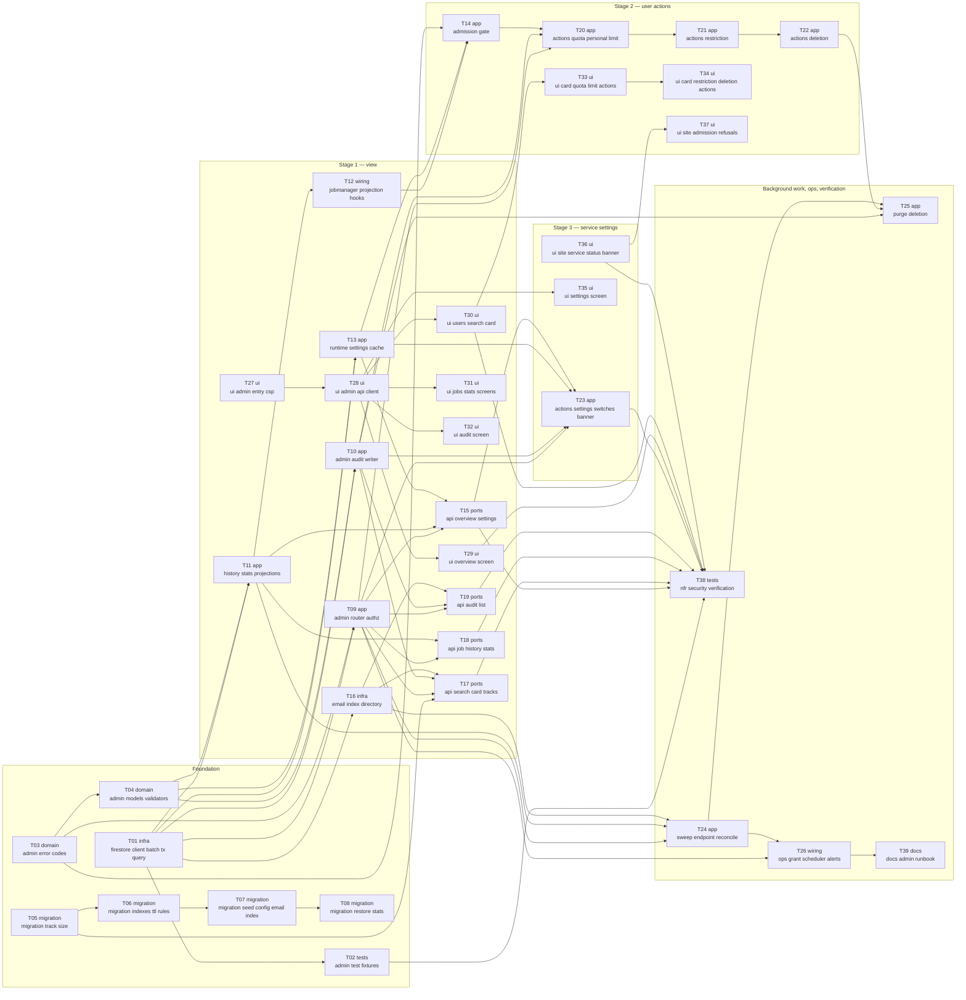

# Epic — admin

> **Spec:** [spec.md](../spec.md) · **Design:** [sad.md](../sad.md) · **Data model:** [data-model.md](../data-model.md) · **API:** [openapi.yaml](../contracts/openapi.yaml) · **ADRs:** [adr/](../adr/)

## Goal

Give the owner one safe place to see and steer the cloud part of Chords Listener — overview, users, jobs, stats and the admin journal (stage 1), per-user quota/limit/restriction/deletion actions (stage 2), and default limits, service switches and the maintenance banner without redeploying (stage 3) — delivering spec §2 goals: cost control, fast support, product insight and readiness for growth.

## Scope

- **In:** `backend-service` (new `backend/app/admin/` package, `admission.py`, hooks in `jobs.py`/`quotas.py`/`auth.py`/`firestore.py`/`publish.py`, internal sweep endpoint, owner grant script, Cloud Scheduler + alerts) and `web-frontend` (new `admin.html` entry + screens; main site gets the public-status reader and refusal messages). Layers: migration · domain · infra · app · ports · ui · wiring · tests · docs (`target_surfaces: [backend-service, web-frontend]`).
- **Out (spec §3):** billing/tariffs; multiple roles or granting admin from the UI; viewing/playing other users' songs or impersonation; guest/device data; real-time alerts in the admin UI.

## Task map

39 tasks · roots that can start immediately: T01, T03, T05, T27, T36 · critical path depth 9. Same DAG as [tasks.json](../tasks.json).

**Parallel lanes:** the frontend lane (T27→T28→screens, T36→T37) runs against the OpenAPI contract with no backend dependency; migrations T05–T08 run serialized alongside T01/T03; T16 (email index) and T11 (projections) proceed in parallel once T01 lands.

**Stage gates (spec §1 delivery):** stage 1 ships after T15–T19 + T27–T32; stage 2 after T14, T20–T22, T33–T34, T37; stage 3 after T23, T35, T36. Background (T24–T26) must be live before the first scheduled deletion can mature (7 days after stage 2).

## Tasks

See [tracker.md](./tracker.md) for status. Machine contract: [tasks.json](../tasks.json).

| # | Task | Layer | Blocked by | DoD (short) |
|---|---|---|---|---|
| [T01](./t01-firestore-client-batch-tx-query.md) | Extend the Firestore REST client with batched writes, transactions, queries and aggregations | infra | — | Emulator tests prove an atomic multi-doc commit with exists/updateMask preconditions, a read-write transaction… |
| [T02](./t02-admin-test-fixtures.md) | Add admin test fixtures, hostile strings and an emulator seeder | tests | T01 | Fixture factories from data-model §Test fixtures exist and a smoke test seeds 1 000 users × 20 tracks into the… |
| [T03](./t03-admin-error-codes.md) | Register the 16 admin error codes and map admin validation errors to invalid_value | domain | — | All 16 new codes exist in ErrorCode with their STATUS_BY_CODE status, and a 422 on any /api/admin/* route retu… |
| [T04](./t04-admin-models-validators.md) | Define admin request/response models with the spec'd validation ranges | domain | T03 | Pydantic models mirror every openapi.yaml schema and unit tests reject each out-of-range value named in AC-04/… |
| [T05](./t05-migration-track-size.md) | Promote migration 01 (tracks.sizeBytes backfill) and write sizeBytes on publish | migration | — | The staged 01 pair is promoted, up then down runs cleanly on the emulator, and a newly published track carries… |
| [T06](./t06-migration-indexes-ttl-rules.md) | Promote migrations 02–03: composite indexes, TTL/exemptions and Firestore rules | migration | T05 | firestore.indexes.json and firestore.rules carry the staged content, and rules tests prove publicStatus is pub… |
| [T07](./t07-migration-seed-config-email-index.md) | Promote migrations 04–05: seed runtime config + public status and build the email index | migration | T06 | On the emulator, 04 creates adminConfig/settings from env and publicStatus/current with only banner/switches/u… |
| [T08](./t08-migration-restore-stats.md) | Promote migration 06: restore pre-launch daily stats from tracks | migration | T07 | On the emulator, 06 with --before <day> writes state=restored days with restoredTracks by source.type only, ne… |
| [T09](./t09-admin-router-authz.md) | Mount the admin router behind allowlist authz, 404-identical denial, probe rate limit and fresh-login check | app | T01, T03 | A contract test iterates every /api/admin/* route and gets a response byte-identical to FastAPI's 404 for a no… |
| [T10](./t10-admin-audit-writer.md) | Implement the audit writer: atomic with Firestore changes, journal-first otherwise, before any view response | app | T01, T04 | Fault-injection tests show a failed audit write leaves state unchanged and returns not_applied/audit_unavailab… |
| [T11](./t11-history-stats-projections.md) | Build job-history and daily-stats projections with the failure-reason map and the pending buffer | app | T01, T04 | Unit+emulator tests show accept/finish are idempotent on replay, a frozen day never changes, ErrorCode maps to… |
| [T12](./t12-jobmanager-projection-hooks.md) | Hook projections into JobManager, accept the origin hint and discard results for tombstoned uids | wiring | T11 | An API test shows an accepted job creates adminJobs + bumps today's counters, a finished job records the outco… |
| [T13](./t13-runtime-settings-cache.md) | Implement runtime settings: 30 s lazy cache, env fallback and the public-status mirror writer | app | T01, T04 | Tests show a settings change is seen by the server within 30 s without polling, env values are used only when… |
| [T14](./t14-admission-gate.md) | Gate all five cloud-job entries through one admission check before Quotas.consume | app | T03, T12, T13 | API tests for each of the five entries show restriction/deletion → cloud_restricted, pause → analyses_paused,… |
| [T15](./t15-api-overview-settings.md) | Serve getOverview and getSettings | ports | T09, T11, T13 | getOverview returns today's UTC totals by origin, vocals, failed, active and new users, running jobs from JobM… |
| [T16](./t16-email-index-directory.md) | Implement the email-index directory: shard load, incremental catch-up and in-memory substring search | infra | T01 | With 10 000 synthetic users, a case-insensitive substring search returns matches in p95 ≤ 1 s with ≤ 10 shard… |
| [T17](./t17-api-search-card-tracks.md) | Serve searchUsers, getUserCard and listUserTracks with view journaling | ports | T05, T09, T10, T16 | API tests show search < 3 chars → query_too_short without journaling, a search and a card view are journaled b… |
| [T18](./t18-api-job-history-stats.md) | Serve listJobHistory and getStats | ports | T09, T11 | Filtering by status=error and origin=link returns only such jobs with per-reason counts, a period > 90 days or… |
| [T19](./t19-api-audit-list.md) | Serve listAudit with email resolution and «видалений» for purged users | ports | T09, T10, T16 | The journal lists records newest-first filtered by admin/user/action with who/when/target/before/after, a tomb… |
| [T20](./t20-actions-quota-personal-limit.md) | Implement resetQuota and set/remove personal limit | app | T09, T10, T14 | A concurrency test shows reset and an analysis accepted in parallel end with usage = analyses accepted after t… |
| [T21](./t21-actions-restriction.md) | Implement restrictUser and unrestrictUser as transactions with the audit record | app | T20 | Tests show restrict stores reason/since/by with an applied audit record and new jobs are refused within 60 s,… |
| [T22](./t22-actions-deletion.md) | Implement scheduleDeletion and cancelDeletion with email confirm, fresh login and the 10-per-60-min cap | app | T21 | Tests show schedule sets purgeAfter = +7 d and an immediate restriction while saving the prior restriction, a… |
| [T23](./t23-actions-settings-switches-banner.md) | Implement setDefaultLimits, setSwitch and setBanner with mirrored, audited batched writes | app | T09, T10, T13, T15 | Tests show a limits change is one commit of config + audit (before/after) and applies within 60 s, a switch ch… |
| [T24](./t24-sweep-endpoint-reconcile.md) | Add the OIDC-protected sweep endpoint: slot claim, buffer replay, stale jobs, reconcile+freeze, index sync | app | T09, T11, T16 | Tests show a non-scheduler token gets the 404 response, a second call for the same slot is a no-op, running jo… |
| [T25](./t25-purge-deletion.md) | Implement tombstone-first, idempotent account purge with anonymization | app | T10, T22, T24 | An emulator test purges a seeded user and then finds no track, audio, quota, users doc, adminAccounts, index e… |
| [T26](./t26-ops-grant-scheduler-alerts.md) | Add the owner grant script, Cloud Scheduler jobs, max-instances guard and alerting | wiring | T09, T24 | admin_grant.py grant/revoke writes/deletes adminAllowlist/{uid} with the owner's ADC (tested against the emula… |
| [T27](./t27-ui-admin-entry-csp.md) | Create the admin.html entry with strict CSP, admin shell, sign-in and not-found for non-admins | ui | — | The Vite build emits admin.html with a CSP meta forbidding inline scripts and eval, the admin bundle contains… |
| [T28](./t28-ui-admin-api-client.md) | Build the admin API client with re-auth flow, error-code i18n and the no-polling refresh policy | ui | T27 | vitest shows each call sends the ID token, reauth_required triggers re-login then retries once, every new erro… |
| [T29](./t29-ui-overview-screen.md) | Build the Overview screen | ui | T28 | Component test renders today's totals by origin, vocals, failed, active/new users, running jobs and switch sta… |
| [T30](./t30-ui-users-search-card.md) | Build user search, the user card and paged songs (metadata only) | ui | T28 | Component tests show < 3 chars prompts for 3 without a request, no matches shows «Нікого не знайдено», HOSTILE… |
| [T31](./t31-ui-jobs-stats-screens.md) | Build the job-history and statistics screens | ui | T28 | Component tests show filters by result/reason/origin/period with per-reason counts and plain-text error snippe… |
| [T32](./t32-ui-audit-screen.md) | Build the admin journal screen | ui | T28 | Component test shows records newest-first with who/when/target/before→after and outcome, purged targets as «ви… |
| [T33](./t33-ui-card-quota-limit-actions.md) | Add quota reset and personal-limit actions to the user card | ui | T30 | Component tests show reset updates the card counters, the limit form shows the allowed range next to each inva… |
| [T34](./t34-ui-card-restriction-deletion-actions.md) | Add restriction and scheduled-deletion actions to the user card | ui | T33 | Component tests show restrict needs a reason, deletion requires typing the user's email, during a scheduled de… |
| [T35](./t35-ui-settings-screen.md) | Build the service-settings screen: default limits, switches and maintenance banner | ui | T28 | Component tests show the limits form explains allowed ranges and points to the pause switch on 0, switches tog… |
| [T36](./t36-ui-site-service-status-banner.md) | Read the public service status on the site: maintenance banner and YouTube-off fallback | ui | — | vitest shows publicStatus/current is read from Firestore at most once per 5 min with zero calls to the cloud s… |
| [T37](./t37-ui-site-admission-refusals.md) | Show admission refusals on the site and send the origin hint | ui | T36 | vitest shows cloud_restricted shows «Хмарний аналіз для вашого акаунта обмежено» with the support email (no ad… |
| [T38](./t38-nfr-security-verification.md) | Add the NFR and security verification suite | tests | T02, T15, T17, T18, T19, T23, T29, T30, T36 | CI runs: ≤ 200 reads per admin endpoint on 1 000×20 and 1×1 000 fixtures, search p95 ≤ 1 s at 10 000 users, se… |
| [T39](./t39-docs-admin-runbook.md) | Document the admin: CLOUD.md section, grant/revoke runbook, migration order and alerts | docs | T26 | docs/CLOUD.md describes granting/revoking admins, migration promotion order 01–06, the sweep schedule and the… |

## Risks / Hard rules

- **No journal — no action** ([ADR-0007](../adr/0007-write-audit-atomically-or-before-the-effect.md)): every state-changing handler and every personal-data view goes through `admin/audit.py`; a task that writes state without it fails review (AC-33/33b).
- **Non-admins see a 404, always** ([ADR-0006](../adr/0006-authorize-admins-via-firestore-allowlist-with-60s-cache.md)): every `/api/admin/*` route carries the authz dependency; T09's contract test enforces it in CI.
- **User text is only text** ([ADR-0002](../adr/0002-ship-admin-ui-as-separate-strict-csp-entry.md)): no `dangerouslySetInnerHTML`/`innerHTML` in `frontend/src/admin/`; strict CSP on `admin.html`.
- **Metadata only:** no admin endpoint or screen exposes audio, chords or edits (AC-06).
- **No polling anywhere** — server caches are lazy TTL; the admin tab refreshes only on open/return/Refresh (AC-02, NFR «Сон сервера»).
- **Logs carry uid only** — never email, titles, banner text or restriction reasons (sad §8 Logging).
- **max-instances = 1** is a precondition for quota/rate-limit correctness (sad §11); T26 adds the deploy guard.
- **Admin rights are granted only by `scripts/admin_grant.py`** — server code has no write path to `adminAllowlist`.
- **Open decisions defaulted here (confirm before implement):** OQ-API-2 restriction text during deletion → fixed `Scheduled deletion` (T22); spec §8 support address → owner email from README (T37); sad §2 deadline/budget still `<TBD by PM>`.
